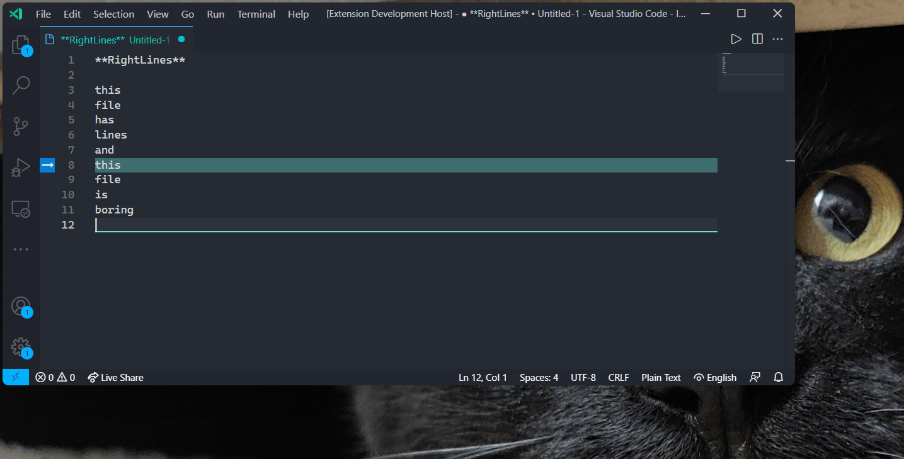
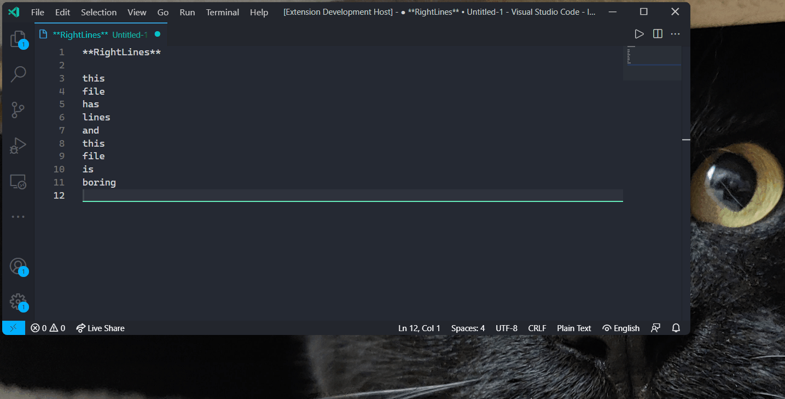
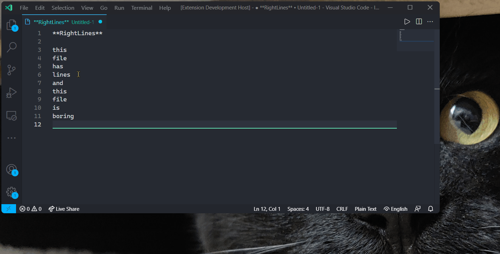

# **RightLines** VS Code Extension

**RightLines** adds commands to Visual Studio Code to identify interesting lines, and clean up files by removing lines in a variety of ways.

## Features

### Mark This Line

`Mark This Line` marks the line where the cursor currently sits.

### Clear **RightLines** Marks

`Clear RightLines Marks` removes all of the marks added to lines by **RightLines**.

### Mark A Specific Line

`Mark A Specific Line...` prompts you to enter the line number of a line to add a mark to.

### Mark Lines Containing

`Mark Lines Containing...` prompts you to enter a string, and marks any lines containing that string.

### Mark Lines Containing Selected Text

`Mark Lines Containing Selected Text` will mark any lines containing the text you have selected.

### Delete Lines Containing

`Delete Lines Containing...` prompts you to enter a string, and deletes any lines containing that string.

### Delete Lines Containing Selected Text

`Delete Lines Containing Selected Text` will delete any lines containing the text you have selected.

### Delete Empty Lines

`Delete Empty Lines` will do exactly what it promises to do 😁.

### Mark Duplicate Lines

`Mark Duplicate Lines` will mark any lines that exist more than once in the document, regardless of leading or trailing whitespace.

### Mark Duplicate Lines (skip first occurrence)

`Mark Duplicate Lines (skip first occurrence)` will mark any lines that exist more than once in the document, regardless of leading or trailing, but won't mark the first instance of each duplicate line.

")

### Delete Duplicate Lines (keep first occurrence)

`Delete Duplicate Lines (keep first occurrence)` will delete any duplicated lines in the document, except for the first occurrence of the line, ignoring leading and trailing whitespace.

")
### Delete Duplicate Lines (keep last occurrence)

`Delete Duplicate Lines (keep last occurrence)` will delete any duplicated lines in the document except for the last occurrence of the line, ignoring leading and trailing whitespace.

")
